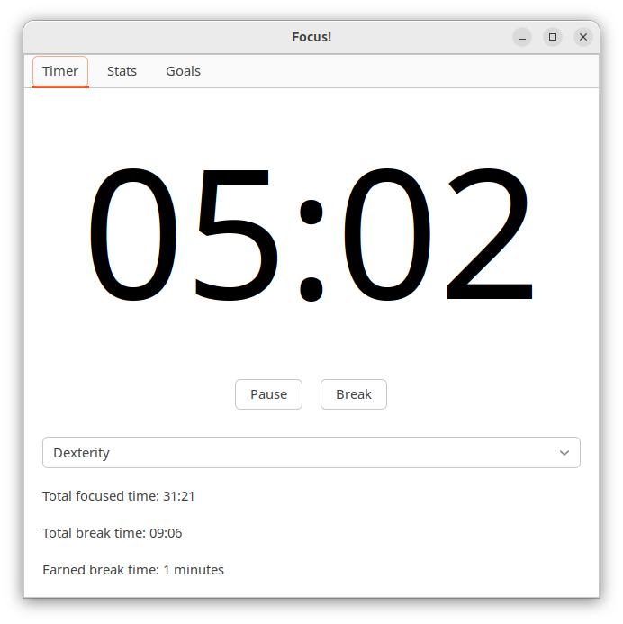

# Focus!: An RPG-Inspired Focus & Skill Development App

[](https://www.gnu.org/licenses/gpl-3.0)



**Focus!** is a free productivity app that combines the power of the Pomodoro
Technique with the engaging elements of RPGs to help you achieve your goals,
improve your focus, and develop valuable skills.

## Overview

Focus! implements the Flowmodoro technique.


**Here's how it works:**

1.  **Define Your Quests (Goals):** Set meaningful goals that align with your
    aspirations, whether it's mastering a new programming language, writing a
    book, or improving your fitness.
2.  **Embrace the Flowmodoro Technique:** Break down your work into focused
    blcocked intervals (Pomodoros) separated by short breaks. This proven
    technique enhances concentration and prevents burnout.
3.  **Level Up Your Skills:** As you complete Pomodoros and achieve goals, you
    earn experience points (XP) in various skills, categorized into RPG-inspired
    attributes:
    *   **Intelligence:** Sharpen your mind through reading, learning, and problem-solving.
    *   **Willpower:** Build your focus, discipline, and resistance to distractions.
    *   **Dexterity:** Enhance your efficiency, time management, and task completion speed.
    *   **Vitality:** Boost your energy levels and overall well-being through healthy habits.
4.  **Track Your Character's Growth:** Watch your character sheet grow as you
    level up your skills and attributes, unlocking new achievements and a deeper
    sense of accomplishment.

## Features

*   **Customizable Flowmodoro Timer:** Adjust the duration of your focus sessions and breaks to fit your workflow.
*   **RPG-Inspired Skill System:** Earn XP and level up skills that reflect your real-world progress.
*   **Goal Setting:** Set meaningful goals and track your progress towards them.

## Why Choose Focus!?

*   **Motivation Through Gamification:** Focus! transforms mundane tasks into
    engaging challenges, making it easier to stay motivated and focused.
*   **Skill Development:** The app encourages you to cultivate valuable skills
    that translate to real-world success.
*   **Personalized Experience:** Customize the app to your preferences and track
    the skills that matter most to you.
*   **Fun and Engaging:** Turn your personal growth journey into an exciting RPG adventure!
*   **Free Software (GPL v3):** Focus! is free software, allowing you to
    contribute to its development and customize it to your needs.

## Installation

**Option 1: From Source (Recommended for Developers):**

1.  Clone the repository:
    ```bash
    git clone 
    ```
2.  Navigate to the project directory:
    ```bash
    cd focus

    ```

**Option 2: Pre-built Binaries (Coming Soon!):**

We are working on providing pre-built binaries for various operating systems.
Check the releases section for updates.

## Usage

1.  Run the application:
    ```bash
    uv run main.py
    ```

## Contributing

We welcome contributions from the community! If you'd like to contribute to Flowmodoro, please follow these guidelines:

1.  Fork the repository.
2.  Create a new branch for your feature or bug fix: `git checkout -b
    feature/your-feature-name` or `git checkout -b bugfix/your-bug-fix-name`
3.  Make your changes and commit them with clear, descriptive commit messages.
4.  Push your branch to your forked repository.
5.  Submit a pull request to the main repository's `main` branch.

Please ensure your code adheres to the project's coding style and includes
appropriate tests.

## License

Focus! is licensed under the **GNU General Public License v3 (GPL v3)**. See the
[LICENSE](LICENSE) file for more details.

## Contact

If you have any questions, suggestions, or just want to chat about Focus!,
feel free to open an issue on GitHub.

**Start your productivity adventure today! Download Focus! and begin your
journey to becoming the hero of your own story.**
